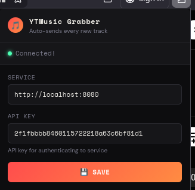
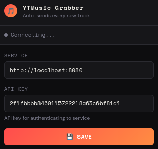

# YTMusic Grabber — Firefox Extension

Grab the currently playing YouTube Music track and ship its video id to a local (or remote) yt-dlp HTTP wrapper.

---

## Install

1. Open Firefox and go to `about:debugging#/runtime/this-firefox`
2. Click **Load Temporary Add-on…**
3. Select the `manifest.json` file inside this folder

For a permanent install, sign the extension via [Firefox Add-on Developer Hub](https://addons.mozilla.org/developers/).

---

## Usage

As long as the extension is loaded an registered with a corrosponding `https://github.com/NHAS/ytdlp-api` service it will just run in the background recording songs every time you're on https://music.youtube.com. 


You can open the extension and see if it is connected successifully to a service. 



If the service is down it will look like this:




## Registration

Please see the server instructions for registration

https://github.com/NHAS/ytdlp-api?tab=readme-ov-file#registration

---

## Settings

| Field | Default | Description |
|---|---|---|
| HTTP POST URL | `http://localhost:8080/` | Where the `https://github.com/NHAS/ytdlp-api` root is |
| API key | *(empty)* | Required api key for adding songs |

---

## POST body

```json
{
  "title": "Song Title",
  "artist": "Artist Name",
  "videoId": "VIDEO_ID"
}
```

---

## Permissions used

| Permission | Reason |
|---|---|
| `activeTab` | Read the current YTM tab to extract track info |
| `storage` | Persist your service URL and settings |
| `https://music.youtube.com/*` | Inject the content script |

No data is sent anywhere except the service URL you configure.
